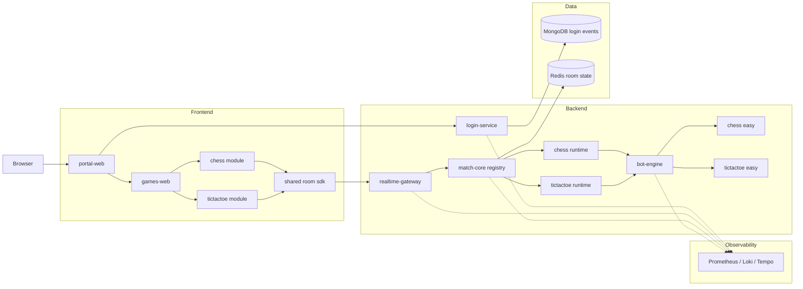
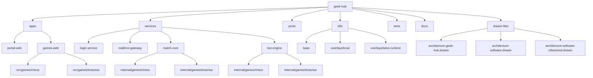

# geek-hub

Monorepo local para um hub de jogos iniciado a partir da evolucao mais recente em Go do Chess-MVP encontrada neste workspace. O projeto foi renomeado e organizado para permanecer com a identidade do repositorio `geek-hub`, com xadrez e jogo da velha ativos sobre a mesma plataforma e com a base pronta para novos modulos.

## Visao Geral

- `geek-hub` separa portal, host de jogos e servicos Go especializados.
- O fluxo atual cobre autenticacao local/Google, menu central, xadrez online, jogo da velha online, bots, Redis, observabilidade, telemetria basica do dispositivo no login e manifests Kubernetes.
- O repositorio foi preparado para revisao local: sem `node_modules`, sem `dist`, sem cache Go e com documentacao concentrada aqui no `README`.

## Diagrama Logico



## Diagrama Do Repositorio



## Componentes

| Componente | Pasta | Responsabilidade |
| --- | --- | --- |
| Portal Web | `apps/portal-web` | Porta de entrada do hub, login Google/local, captura de contexto do navegador/dispositivo, persistencia de sessao e menu principal de jogos. |
| Games Web | `apps/games-web` | Host frontend dos jogos; hoje publica xadrez em `/games/chess` e jogo da velha em `/games/tictactoe`. |
| Login Service | `services/login-service` | API de login Google, validacao do payload, gravacao do perfil basico e da telemetria do dispositivo no MongoDB, readiness e observabilidade do fluxo de autenticacao. |
| Realtime Gateway | `services/realtime-gateway` | API HTTP/WebSocket do jogo, Socket.IO, sinalizacao WebRTC, health checks e metricas de borda. |
| Match Core | `services/match-core` | Runtime autoritativo das partidas, com registro multi-jogo para xadrez e jogo da velha, relogio, sincronizacao de estado e integracao com Redis/bot. |
| Bot Engine | `services/bot-engine` | Motor de estrategia para modos de treino, exposto via gRPC, hoje atendendo xadrez e jogo da velha no modo `bot_easy`. |
| Modulos de jogo | `apps/games-web/src/games` | Implementacoes especificas de cada jogo no frontend, hoje com `chess` e `tictactoe`, mantendo a mesma base de lobby, chat, sessao e navegacao. |
| Runtimes de jogo | `services/match-core/internal/games` | Adaptadores autoritativos por jogo, cada um com regras, snapshot, persistencia e integracao com bot usando a mesma plataforma. |
| Estrategias de bot | `services/bot-engine/internal/games` | Heuristicas especificas por jogo para o modo de treino, hoje com estrategia easy para xadrez e jogo da velha. |
| Proto | `proto` | Contratos gRPC entre `realtime-gateway`, `match-core` e `bot-engine`. |
| Kubernetes Base | `k8s/base` | Deployments, Services, Ingress, Redis, secrets, network policies e ServiceMonitors. |
| Overlay Local | `k8s/overlays/local` | Customizacoes para execucao local com imagens `:dev`. |
| Overlay Talos Runtime | `k8s/overlays/talos-runtime` | Variante para runtime Talos com source injection por ConfigMap. |
| Testes E2E | `tests/portal-e2e` | Smoke tests Playwright para home do portal e fluxo de visitante. |
| Docs | `docs` | Notas complementares, como avaliacao do `bot-engine`. |
| Diagramas editaveis | `architecture-geek-hub.drawio`, `architecture-software.drawio`, `architecture-software-refactored.drawio` | Fontes Draw.io para refinamento da arquitetura. |

## Descritivo De Cada Componente

### `apps/portal-web`

- Centraliza a autenticacao e o menu do hub.
- Salva `authSession` e sessao de sala no storage local.
- Coleta telemetria basica do cliente no momento do login Google.
- Encaminha o usuario para xadrez e jogo da velha, preservando o contexto da sessao entre modulos.

Arquivos-chave:
- `src/App.tsx`: alterna entre home e menu.
- `src/components/HomeView.tsx`: login Google e acesso visitante.
- `src/components/GameMenu.tsx`: vitrine dos jogos disponiveis e futuros.

### `apps/games-web`

- Publica o cliente web dos jogos do hub.
- Conecta no `realtime-gateway` via Socket.IO.
- Mantem estado local de sessao, lobby, chat e sinalizacao WebRTC.
- Hoje inclui os modulos `chess` e `tictactoe`, reaproveitando a mesma malha de sessao, treino, chat e observabilidade.

Arquivos-chave:
- `src/App.tsx`: resolve o slug do jogo a partir da rota.
- `src/games/chess/ChessGame.tsx`: fluxo principal do xadrez.
- `src/games/tictactoe/TicTacToeGame.tsx`: fluxo principal do jogo da velha.
- `src/components/GameView.tsx`: tabuleiro, acoes e estado visual do xadrez.
- `src/components/TicTacToeView.tsx`: tabuleiro, acoes e estado visual do jogo da velha.
- `src/components/Lobby.tsx`: casca comum de lobby, chat e acoes de entrada reaproveitada pelos dois jogos.

### Modulos de jogo

- `chess`: cliente completo do xadrez com tabuleiro 8x8, historico SAN, relogio opcional, treino e jogo online.
- `tictactoe`: cliente do jogo da velha com tabuleiro 3x3, mesma malha de lobby, chat, treino, WebRTC e observabilidade.
- Ambos compartilham storage local, reconexao de sala, chamadas Socket.IO e navegacao a partir do portal.

### `services/realtime-gateway`

- Exponibiliza `/socket.io`, `/metrics`, `/health/live`, `/health/ready` e `/api/info`.
- Faz o papel de gateway entre browser e `match-core`.
- Instrumenta logs, metricas HTTP e tracing OTEL.
- Mantem o chat da sala, a sinalizacao WebRTC e o coaching do modo treino para ambos os jogos.

Arquivos-chave:
- `cmd/realtime-gateway/main.go`: bootstrap HTTP e lifecycle.
- `internal/gateway/socket_server.go`: eventos Socket.IO e ticker.
- `internal/gateway/matchcore_client.go`: cliente gRPC do `match-core`.

### `services/login-service`

- Exponibiliza `/api/auth/logins`, `/metrics`, `/health/live`, `/health/ready` e `/api/info`.
- Valida o payload do login Google e grava os eventos na collection `geek_hub.user_login_events`.
- Persiste dados de dispositivo e navegador, como `deviceType`, `platform`, `browser`, `region`, `deviceModel`, `browserVersion` e `platformVersion`.
- Centraliza a observabilidade e o readiness do fluxo de autenticacao.

Arquivos-chave:
- `cmd/login-service/main.go`: bootstrap HTTP e lifecycle do servico.
- `internal/login/repository.go`: persistencia MongoDB e indices da collection.
- `internal/login/config.go`: configuracao de conexao com Mongo e parametros do servico.

### `services/match-core`

- Mantem a logica autoritativa de salas e partidas.
- Resolve o runtime do jogo e aplica comandos como `create_room`, `join_room`, `submit_action` e `tick_active_rooms`.
- Persiste snapshots, presenca e relogio no Redis.
- Hoje registra dois runtimes: `chess` e `tictactoe`.

Arquivos-chave:
- `cmd/match-core/main.go`: servidor gRPC e endpoint de metricas.
- `internal/games/chess/service.go`: regras de negocio do xadrez.
- `internal/games/tictactoe/service.go`: regras de negocio do jogo da velha.
- `internal/games/chess/store.go`: persistencia em Redis.
- `internal/games/tictactoe/store.go`: persistencia em Redis com prefixo proprio do jogo da velha.
- `internal/platform/runtime.go`: registro e resolucao dos runtimes.

### `services/bot-engine`

- Entrega jogadas de treino para `bot_easy`.
- Recebe estado da partida via gRPC e devolve a proxima acao recomendada.
- Ja nasce integrado ao pipeline de tracing/logs.
- O modo easy do jogo da velha prioriza vitoria imediata, bloqueio, centro, cantos e laterais.

Arquivos-chave:
- `cmd/bot-engine/main.go`: servidor gRPC do motor.
- `internal/games/chess/easy.go`: heuristica simples de selecao de lance.
- `internal/games/tictactoe/easy.go`: heuristica simples de selecao de jogada para o jogo da velha.

### `k8s`

- `base`: definicoes compartilhadas do ambiente.
- `overlays/local`: fluxo simples para build local e deploy com imagens dev.
- `overlays/talos-runtime`: opcao para runtime Talos usando ConfigMaps com fontes espelhados.

### `tests/portal-e2e`

- Valida renderizacao da home.
- Verifica o fluxo "continuar como visitante" ate o menu do hub.
- Serve como smoke test rapido da camada web.

## Matriz De Funcionalidades

| Funcionalidade | Xadrez | Jogo da Velha | Componentes envolvidos |
| --- | --- | --- | --- |
| Login portal + retomada de sessao | Sim | Sim | `portal-web`, `games-web`, storage local |
| Treino contra `bot_easy` | Sim | Sim | `games-web`, `realtime-gateway`, `match-core`, `bot-engine` |
| Jogo online PvP | Sim | Sim | `games-web`, `realtime-gateway`, `match-core` |
| Chat da sala | Sim | Sim | `games-web`, `realtime-gateway` |
| Sinalizacao WebRTC entre jogadores | Sim | Sim | `games-web`, `realtime-gateway` |
| Persistencia de salas e relogios | Sim | Sim | `match-core`, `Redis` |
| Metricas, logs e traces | Sim | Sim | `login-service`, `realtime-gateway`, `match-core`, `bot-engine` |

## Estrutura

```text
geek-hub/
├── apps/
│   ├── games-web/
│   └── portal-web/
├── docs/
├── k8s/
│   ├── base/
│   └── overlays/
│       ├── local/
│       └── talos-runtime/
├── proto/
├── services/
│   ├── bot-engine/
│   ├── login-service/
│   ├── match-core/
│   └── realtime-gateway/
├── tests/
│   └── portal-e2e/
├── Makefile
├── README.md
└── skaffold.yaml
```

## Fluxo Da Aplicacao

1. O usuario entra em `portal-web` e autentica com Google ou visitante.
2. Quando o login Google e usado, o portal registra no `login-service` o perfil basico e a telemetria do navegador/dispositivo.
3. O portal redireciona para `games-web`, hoje com os modulos de xadrez e jogo da velha.
4. O cliente abre um canal Socket.IO com `realtime-gateway`.
5. O gateway delega comandos de sala e partida ao `match-core`.
6. O `match-core` resolve o runtime do jogo (`chess` ou `tictactoe`), persiste estado no Redis e chama o `bot-engine` quando necessario.
7. Metricas e traces ficam prontos para Prometheus, Loki e Tempo.

## Como Rodar

### Pre-requisitos

- `docker`
- `kubectl`
- `skaffold`
- cluster Kubernetes local com Ingress NGINX, MetalLB e `local-path`
- `npm` para os apps web e testes
- `go 1.24` para os servicos

### Instalar dependencias web

```bash
make deps
```

### Build das imagens

```bash
make docker-build
```

### Aplicar no cluster

```bash
make apply
```

### Rodar em modo iterativo

```bash
skaffold dev
```

## Kubernetes E Observabilidade

- Namespace padrao: `chess-dev`
- Host funcional previsto: `chess.local`
- Ingress e services ficam em `k8s/base`
- ServiceMonitors para `login-service`, `realtime-gateway` e `match-core` ja estao presentes
- Os servicos Go ja expoem health checks, metricas e tracing OTLP

## Origem Da Base

Este repositorio foi inicializado com a base mais recente em Go do Chess-MVP encontrada localmente na pasta `games-platform/`, e depois adaptado para o nome final `geek-hub`.

As principais adequacoes feitas nessa inicializacao foram:

- rename de branding para `geek-hub`
- ajuste de imports Go para `github.com/Marques-net/geek-hub`
- troca de nomes de imagens, labels, secrets e manifests Kubernetes
- alinhamento de storage keys e nomes de pacotes frontend
- consolidacao da documentacao arquitetural no `README`
