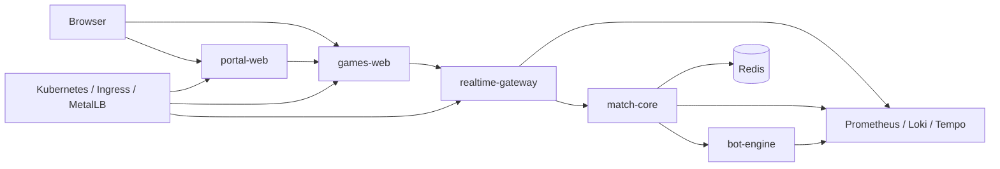
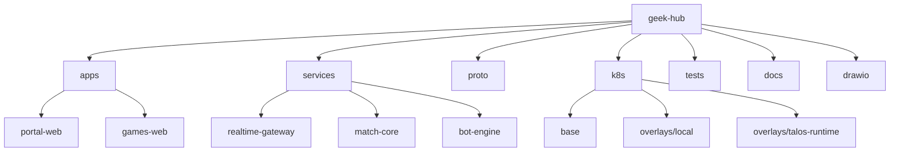

# geek-hub

Monorepo local para um hub de jogos iniciado a partir da evolucao mais recente em Go do Chess-MVP encontrada neste workspace. O projeto foi renomeado e organizado para permanecer com a identidade do repositorio `geek-hub`, mantendo o xadrez como primeiro jogo e deixando a base pronta para novos modulos.

## Visao Geral

- `geek-hub` separa portal, host de jogos e servicos Go especializados.
- O fluxo atual cobre autenticacao local/Google, menu central, xadrez online, bots, Redis, observabilidade e manifests Kubernetes.
- O repositorio foi preparado para revisao local: sem `node_modules`, sem `dist`, sem cache Go e com documentacao concentrada aqui no `README`.

## Diagrama Logico



## Diagrama Do Repositorio



## Componentes

| Componente | Pasta | Responsabilidade |
| --- | --- | --- |
| Portal Web | `apps/portal-web` | Porta de entrada do hub, login Google/local, persistencia de sessao e menu principal de jogos. |
| Games Web | `apps/games-web` | Host frontend dos jogos; hoje publica o modulo de xadrez em `/games/chess`. |
| Realtime Gateway | `services/realtime-gateway` | API HTTP/WebSocket, Socket.IO, sinalizacao WebRTC, health checks e metricas de borda. |
| Match Core | `services/match-core` | Runtime autoritativo das partidas, regras do xadrez, relogio, sincronizacao de estado e integracao com Redis/bot. |
| Bot Engine | `services/bot-engine` | Motor de estrategia para modos de treino, exposto via gRPC. |
| Proto | `proto` | Contratos gRPC entre `realtime-gateway`, `match-core` e `bot-engine`. |
| Kubernetes Base | `k8s/base` | Deployments, Services, Ingress, Redis, secrets, network policies e ServiceMonitors. |
| Overlay Local | `k8s/overlays/local` | Customizacoes para execucao local com imagens `:dev`. |
| Overlay Talos Runtime | `k8s/overlays/talos-runtime` | Variante para runtime Talos com source injection por ConfigMap. |
| Testes E2E | `tests/portal-e2e` | Smoke tests Playwright para home do portal e fluxo de visitante. |
| Docs | `docs` | Notas complementares, como avaliacao do `bot-engine`. |
| Diagramas editaveis | `architecture-geek-hub.drawio`, `architecture-software.drawio`, `architecture-software-refactored.drawio` | Fontes Draw.io para refinamento da arquitetura. |

## Descritivo De Cada Componente

### `apps/portal-web`

- Centraliza a autenticacao e o menu do hub.
- Salva `authSession` e sessao de sala no storage local.
- Encaminha o usuario para o xadrez e prepara a UX para jogos futuros.

Arquivos-chave:
- `src/App.tsx`: alterna entre home e menu.
- `src/components/HomeView.tsx`: login Google e acesso visitante.
- `src/components/GameMenu.tsx`: vitrine dos jogos disponiveis e futuros.

### `apps/games-web`

- Publica o cliente web de xadrez.
- Conecta no `realtime-gateway` via Socket.IO.
- Mantem estado local de sessao, lobby, chat e sinalizacao WebRTC.

Arquivos-chave:
- `src/App.tsx`: resolve o slug do jogo a partir da rota.
- `src/games/chess/ChessGame.tsx`: fluxo principal do jogo.
- `src/components/GameView.tsx`: tabuleiro, acoes e estado visual da partida.

### `services/realtime-gateway`

- Exponibiliza `/socket.io`, `/metrics`, `/health/live`, `/health/ready` e `/api/info`.
- Faz o papel de gateway entre browser e `match-core`.
- Instrumenta logs, metricas HTTP e tracing OTEL.

Arquivos-chave:
- `cmd/realtime-gateway/main.go`: bootstrap HTTP e lifecycle.
- `internal/gateway/socket_server.go`: eventos Socket.IO e ticker.
- `internal/gateway/matchcore_client.go`: cliente gRPC do `match-core`.

### `services/match-core`

- Mantem a logica autoritativa de salas e partidas.
- Resolve o runtime do jogo e aplica comandos como `create_room`, `join_room`, `submit_action` e `tick_active_rooms`.
- Persiste snapshots, presenca e relogio no Redis.

Arquivos-chave:
- `cmd/match-core/main.go`: servidor gRPC e endpoint de metricas.
- `internal/games/chess/service.go`: regras de negocio do xadrez.
- `internal/games/chess/store.go`: persistencia em Redis.
- `internal/platform/runtime.go`: registro e resolucao dos runtimes.

### `services/bot-engine`

- Entrega jogadas de treino para `bot_easy`.
- Recebe estado da partida via gRPC e devolve a proxima acao recomendada.
- Ja nasce integrado ao pipeline de tracing/logs.

Arquivos-chave:
- `cmd/bot-engine/main.go`: servidor gRPC do motor.
- `internal/games/chess/easy.go`: heuristica simples de selecao de lance.

### `k8s`

- `base`: definicoes compartilhadas do ambiente.
- `overlays/local`: fluxo simples para build local e deploy com imagens dev.
- `overlays/talos-runtime`: opcao para runtime Talos usando ConfigMaps com fontes espelhados.

### `tests/portal-e2e`

- Valida renderizacao da home.
- Verifica o fluxo "continuar como visitante" ate o menu do hub.
- Serve como smoke test rapido da camada web.

## Estrutura

```text
geek-hub/
├── apps/
│   ├── games-web/
│   └── portal-web/
├── docs/
├── k8s/
│   ├── base/
│   └── overlays/
│       ├── local/
│       └── talos-runtime/
├── proto/
├── services/
│   ├── bot-engine/
│   ├── match-core/
│   └── realtime-gateway/
├── tests/
│   └── portal-e2e/
├── Makefile
├── README.md
└── skaffold.yaml
```

## Fluxo Da Aplicacao

1. O usuario entra em `portal-web` e autentica com Google ou visitante.
2. O portal redireciona para `games-web`, hoje com o modulo de xadrez.
3. O cliente abre um canal Socket.IO com `realtime-gateway`.
4. O gateway delega comandos de sala e partida ao `match-core`.
5. O `match-core` persiste estado no Redis e chama o `bot-engine` quando necessario.
6. Metricas e traces ficam prontos para Prometheus, Loki e Tempo.

## Como Rodar

### Pre-requisitos

- `docker`
- `kubectl`
- `skaffold`
- cluster Kubernetes local com Ingress NGINX, MetalLB e `local-path`
- `npm` para os apps web e testes
- `go 1.24` para os servicos

### Instalar dependencias web

```bash
make deps
```

### Build das imagens

```bash
make docker-build
```

### Aplicar no cluster

```bash
make apply
```

### Rodar em modo iterativo

```bash
skaffold dev
```

## Kubernetes E Observabilidade

- Namespace padrao: `chess-dev`
- Host funcional previsto: `chess.local`
- Ingress e services ficam em `k8s/base`
- ServiceMonitors para `realtime-gateway` e `match-core` ja estao presentes
- Os servicos Go ja expoem health checks, metricas e tracing OTLP

## Origem Da Base

Este repositorio foi inicializado com a base mais recente em Go do Chess-MVP encontrada localmente na pasta `games-platform/`, e depois adaptado para o nome final `geek-hub`.

As principais adequacoes feitas nessa inicializacao foram:

- rename de branding para `geek-hub`
- ajuste de imports Go para `github.com/Marques-net/geek-hub`
- troca de nomes de imagens, labels, secrets e manifests Kubernetes
- alinhamento de storage keys e nomes de pacotes frontend
- consolidacao da documentacao arquitetural no `README`
